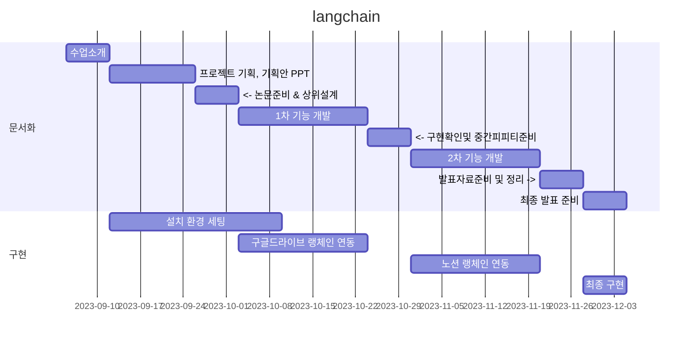

# langchain

```mermaid
gantt
    title langchain
    dateFormat YYYY-MM-DD
    section 문서화
        수업소개         :a1, 2023-09-05, 7d
         프로젝트 기획, 기획안 PPT         :a2, 2023-09-12, 14d
         <- 논문준비 & 상위설계    :a3, 2023-09-26, 7d
        1차 기능 개발    :a4,2023-10-03, 21d
      <- 구현확인및 중간피피티준비    :a5,2023-10-24, 7d
         2차 기능 개발    :a6,2023-10-31, 21d
         발표자료준비 및 정리 ->     :a7,2023-11-21, 7d
         최종 발표 준비     :a8,2023-11-28, 7d
    section 구현
        설치 환경 세팅 :2023-09-12, 28d
        구글드라이브 랭체인 연동    :2023-10-03, 21d
        노션 랭체인 연동     :2023-10-31, 21d
         최종 구현    :2023-11-28, 7d

```
